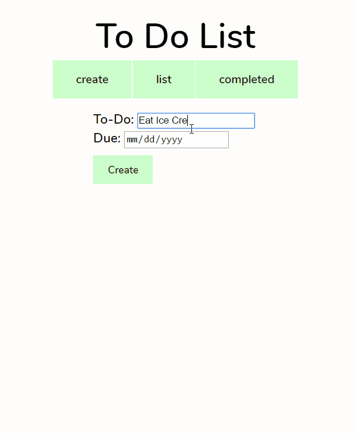
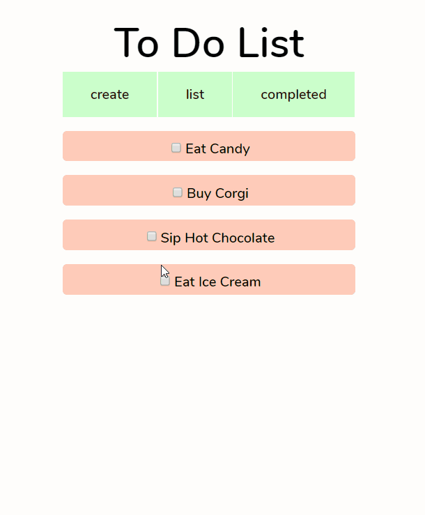
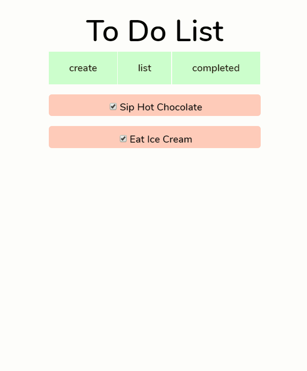

# Angular To-Do

#### This app uses Angular directives, controllers and services to create a minimalist and stylist to-do list.

### Create an item

#### The create box lies in this state. Takes in 2 parameters, the item you want to complete and a due date. When submit is clicked, the app automatically logs the item as incomplete.

### Listing Items

#### Items are listed in this state. Once an item is complete, you can checkmark the item. Using ng-click, the item's completed state is changed from false to true and is moved into the completed state.

### Completed State

#### Once the item has been logged as completed, it is display on the completed state, to admire all that you've accomplished!

